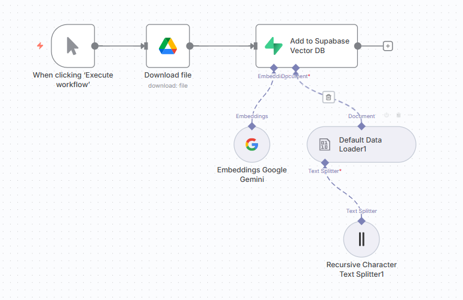
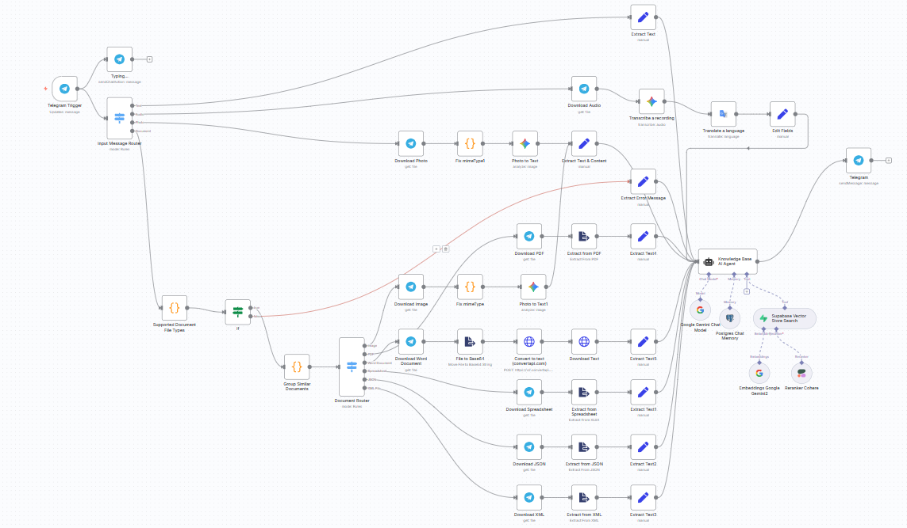

# 🤖 Multi-Modal Telegram Support Bot with Gemini 2.5 Flash and Supabase RAG

Transform your Telegram into an intelligent AI assistant that can handle text, voice, images, and documents with advanced RAG (Retrieval Augmented Generation) capabilities. This workflow leverages n8n, Google Gemini 2.5, Supabase vector database, and multiple AI services to create a comprehensive support bot.

***

## 🌟 Workflow Overview





***

## ⚙️ How It Works

### 🔁 Message Routing

1. **Telegram Trigger** captures the user message (Text, Image, Voice, Document)
2. **Message Router** routes input by type using a Switch node
3. Each type is handled separately:
   - **Voice** → Transcribe recording to text (.ogg, .mp3)
   - **Image** → Analyze image to text
   - **Text** → Sent directly to AI Agent (.txt)
   - **Document** → Parsed (e.g. .docx to .txt) accordingly

#### 📎 Document Type Routing

Before routing documents by type, the **Supported Document File Types** node first checks if the file extension is allowed. If not supported, it exits early with an error message — preventing unnecessary processing.

Supported documents are then routed using the **Document Router** node, and converted to text for further processing.

#### Supported Document File Types

**.jpg**   **.jpeg**   **.png**   **.webp**   **.pdf**   **.doc**   **.docx**   **.xls**   **.xlsx**   **.json**   **.xml**

4. The text content is combined with stored memory and embedded knowledge using a **RAG** approach, enabling the AI to respond based on real uploaded data.

### 🧠 RAG via Supabase

Uploaded documents are vectorized using OpenAI Embeddings. Embeddings are stored in Supabase with metadata. On new questions, the chatbot:
- Extracts question intent
- Queries Supabase for semantically similar chunks
- Injects them into the prompt for OpenAI
- OpenAI generates a grounded response based on actual document content

5. Response is sent to the Telegram user with content awareness.

***

## 🎓 Technical Stack

- **[n8n](https://n8n.io/)**: No-code workflow automation engine (self-hosted via Docker or Cloud)
- **Telegram Bot API**: Secure, real-time messaging input with multi-modal support
- **Google Gemini 2.5 Flash/Pro**: State-of-the-art AI for text generation, image analysis, and audio transcription
- **Supabase**: Vector database for RAG functionality and document embeddings
- **PostgreSQL**: Chat memory storage for conversation context
- **ConvertAPI**: Document conversion service (Word to text)
- **Cohere**: Re-ranking for improved search results
- **Google Translate**: Multi-language support for voice messages

### 🔧 Core Features

- **Multi-Modal Input Support**: Text, voice notes, images, and various document formats
- **RAG Implementation**: Knowledge base integration with semantic search
- **Conversation Memory**: Persistent chat history using PostgreSQL
- **Smart Document Processing**: Automatic file type detection and appropriate conversion
- **Image Analysis**: Visual content understanding via Gemini Vision
- **Voice Transcription**: Speech-to-text with translation capabilities
- **Vector Search**: Enhanced retrieval with Cohere re-ranking

***

## 🛠️ Setup Instructions

### 1. Prerequisites & API Keys Required

- Google Drive API Key
- Telegram Bot Token ([Setup Guide](https://docs.n8n.io/integrations/builtin/credentials/telegram/))
- Google Gemini API Key
- Supabase API Key + Environment
- ConvertAPI Key
- Cohere API Key
- PostgreSQL Database (or use n8n default simple memory node)

### 2. Clone this repo and set up n8n (Docker recommended)

- Clone the repository:
  ```bash
  git clone 
  cd 
  ```
- Set up n8n using Docker:
  ```bash
  docker run -it --rm --name n8n -p 5678:5678 \
    -v ~/n8n_data:/home/node/.n8n \
    n8nio/n8n
  ```
- Import the workflow JSON file into your n8n instance

### 3. Create and configure a Telegram bot

- Start a conversation with [BotFather](https://core.telegram.org/bots#botfather) in Telegram
- Run `/newbot`, follow instructions to name and create your bot
- Copy the API token provided by BotFather
- In n8n, add your Telegram credentials with this token

### 4. Configure Google Services

- **Gemini API**: Get your API key from [Google AI Studio](https://ai.google.dev/)
- **Google Drive**: Set up OAuth2 for document access
- **Google Translate**: Configure for multi-language support
- Add all Google credentials to n8n

### 5. Set up Supabase Vector Database

- Create a Supabase project and get your API credentials
- Create a `documents` table for vector storage
- Configure the Supabase integration in n8n with your credentials

### 6. Configure Additional Services

- **ConvertAPI**: Get API key for document conversion
- **Cohere**: Set up API key for search re-ranking
- **PostgreSQL**: Configure database for chat memory storage

### 7. Knowledge Base Setup

⚠️ **Before using the Telegram chatbot**: Manually run the knowledge base import workflow to import your documents from Google Drive into Supabase with vector embeddings. This enables the Telegram chatbot to answer questions based on real content.

***

## 💡 Usage

### Text Messages
Send any text question to your bot for AI-powered responses with RAG knowledge integration.

### Voice Messages
Send voice notes in any language - they'll be automatically transcribed and translated to English for processing.

### Images
Send photos or images for AI analysis and description, with optional caption integration.

### Documents
Upload supported document types for automatic text extraction and knowledge base integration:
- **PDFs**: Automatic text extraction
- **Word Documents**: Converted to text via ConvertAPI
- **Spreadsheets**: Data extraction and processing
- **Images in Documents**: Analysis and description
- **JSON/XML**: Structured data processing

***

## 🧠 AI Capabilities

### Knowledge Base Agent
- **RAG-powered responses** using your uploaded documents
- **Conversation memory** that remembers chat history
- **Multi-source knowledge** combining uploaded docs with Gemini's training
- **Smart retrieval** with Cohere re-ranking for better results

### Multi-Modal Processing
- **Image Analysis**: Gemini 2.5 Pro for detailed image understanding
- **Voice Transcription**: Gemini 1.5 Flash for accurate speech-to-text
- **Document Processing**: Intelligent text extraction from various formats
- **Language Support**: Automatic translation for international users

***

## 🔒 Security Features

- **File Type Validation**: Only processes supported file types
- **Error Handling**: Graceful handling of unsupported formats
- **Memory Isolation**: Chat sessions are isolated by user ID
- **Secure Credentials**: All API keys stored securely in n8n

***

## 🚀 Advanced Features

### RAG Implementation
- **Vector Embeddings**: Documents are converted to embeddings using Google Gemini
- **Semantic Search**: Find relevant content based on meaning, not just keywords
- **Re-ranking**: Cohere improves search result relevance
- **Context Injection**: Retrieved content is seamlessly integrated into responses

### Conversation Management
- **Persistent Memory**: Chat history stored in PostgreSQL
- **Context Window**: Configurable conversation length (default: 3 messages)
- **Session Management**: Each chat maintains separate conversation state

***

## 🔧 Customization Options

### Extend Document Support
- Add new file type processors
- Implement custom extraction logic
- Integrate additional conversion services

### Enhance AI Capabilities
- Modify system prompts for different use cases
- Add specialized tools and functions
- Integrate additional AI models

### Scale the System
- Implement user management
- Add rate limiting
- Set up monitoring and analytics

***

## 🤝 Contributing

PRs, suggestions, and workflow extensions are welcome! Areas for contribution:
- Additional file format support
- Enhanced RAG algorithms
- UI improvements
- Performance optimizations
- New AI model integrations

***

## 📄 License

APACHE 2.0

***

## 👤 Author

Built by [Ashgen12](https://github.com/Ashgen12/)

***

## 🆘 Troubleshooting

### Common Issues

1. **Unsupported file types**: Check the supported formats list above
2. **API rate limits**: Ensure you have sufficient API quotas
3. **Memory issues**: Verify PostgreSQL connection and table setup
4. **Document processing failures**: Check ConvertAPI credits and configuration

### Getting Help

- Check the n8n community forum for workflow-specific questions
- Review API documentation for service-specific issues
- Ensure all credentials are properly configured in n8n
