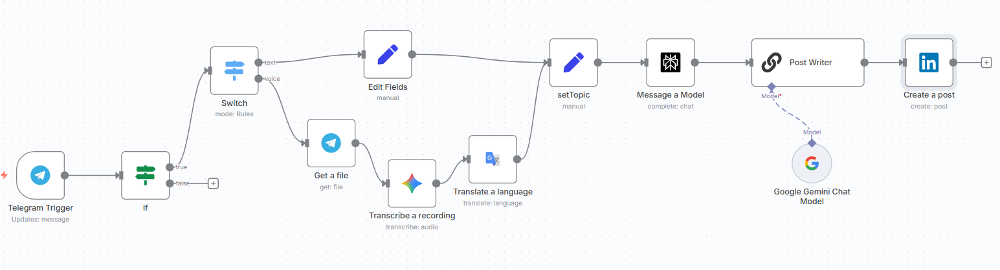

# 🤖 LinkedIn Viral Post Maker Using n8n, Gemini, and Telegram

Transform any Telegram message or voice note into a fact-rich, viral LinkedIn post—automatically. This workflow leverages n8n, Telegram, and Google Gemini to capture your ideas instantly, enrich them with research and pro content strategies, and publish them on LinkedIn with zero manual effort.

---

## 🌟 Workflow Overview

---

## ⚙️ How It Works

### 📲 Input & Trigger

- **Telegram Trigger**: Listens for incoming messages on your Telegram bot (supports Text and Voice).
- **If Node**: Ensures only messages from your authenticated chat ID are processed (security).

### 🔁 Message Routing

- **Switch Node**: Routes incoming messages by type (`text`, `voice`).
  - **Text Messages**: Sent directly for editing and topic extraction.
  - **Voice Messages**: Downloaded → Transcribed → Optionally translated to target language → Edited.

### 🎙️ Voice Message Processing

- **Get a File**: Downloads audio (e.g., .ogg/.mp3) from Telegram.
- **Transcribe a Recording**: Converts speech to text using advanced ASR.
- **Translate a Language** (optional): Automatically translates the transcript if needed.

### ✏️ Preprocessing

- **Edit Fields / setTopic Nodes**: Standardize and refine the input text for optimal prompt quality.

### 💡 Content Generation

- **Message a Model**: Sends the cleaned topic to Google Gemini Chat Model with a powerful, research-backed system prompt.
- **Post Writer**: Refines the AI-generated output, ensuring it matches LinkedIn viral post best practices (removes unwanted format, adjusts tone).

### 🚀 Output

- **Create a Post**: Instantly publishes the resulting post to your LinkedIn profile.

---

## 🎓 Technical Stack

- **[n8n](https://n8n.io/)**: No-code workflow automation engine (self-hosted via Docker or Cloud).
- **Telegram Bot API**: Secure, real-time messaging input.
- **Google Gemini 2.5 Flash/Pro**: State-of-the-art generative AI for text transformation.
- **Audio ASR and Translator nodes**: Powered via Google or other n8n integrations.
- **LinkedIn API**: Direct publishing using OAuth2 secure credentials.

### ❗ Why Gemini?

Gemini models excel at viral writing, hooking, and professional social content—making them ideal to turn raw ideas into market-ready posts.

---

## 🧠 System Prompt Framework

- Merges your own ideas with live or recent research, industry stats, and expert perspectives.
- Implements proven content structures (hook, story, personal, CTA).
- Designed for viral engagement, authority-building, and actionable insights.

---

## 🔒 Security

- Only allows messages from your authorized Telegram chat ID.
- All credentials (LinkedIn, Gemini, Telegram) are stored securely.

---

## 🖼️ Including the Workflow Image

- The image should be placed directly after the "Workflow Overview" header for visual clarity and immediate understanding.

## 🛠️ Setup Instructions

**Clone this repo and set up n8n (Docker recommended):**

**Create and configure a Telegram bot**  
Use BotFather for setup  
Add token to n8n credentials

**Configure Google Gemini Node**  
Get your Gemini API key and input in n8n  
Insert the provided system prompt in the Message a Model node

**Connect LinkedIn Integration**  
Authenticate via OAuth2 in n8n credentials  
Test post creation

**Customize or extend workflow**  
Add support for image, document, RAG, etc.  
Improve system prompts or post formatting

---

## 💡 Usage

Send a text or voice message to your Telegram bot  
Instantly receive a viral, research-backed LinkedIn post, ready for review or auto-posting

---

## 🚀 Contributing

PRs, prompt suggestions, and workflow extensions are welcome! Start a discussion or make a pull request.

---

## 📄 License

MIT

---

## 👤 Author

Built by [Ashgen12](https://github.com/Ashgen12/)
